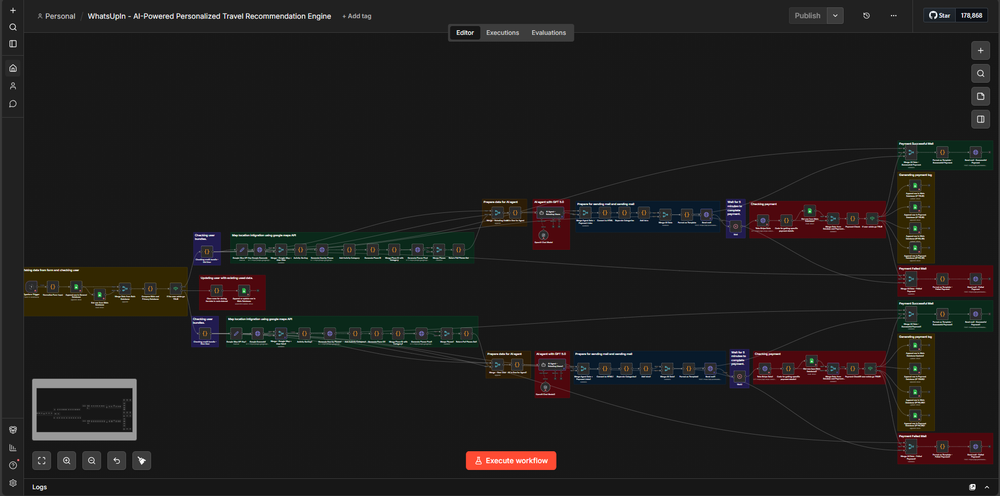
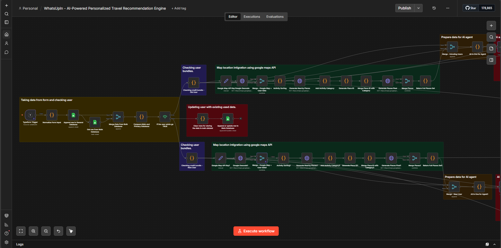
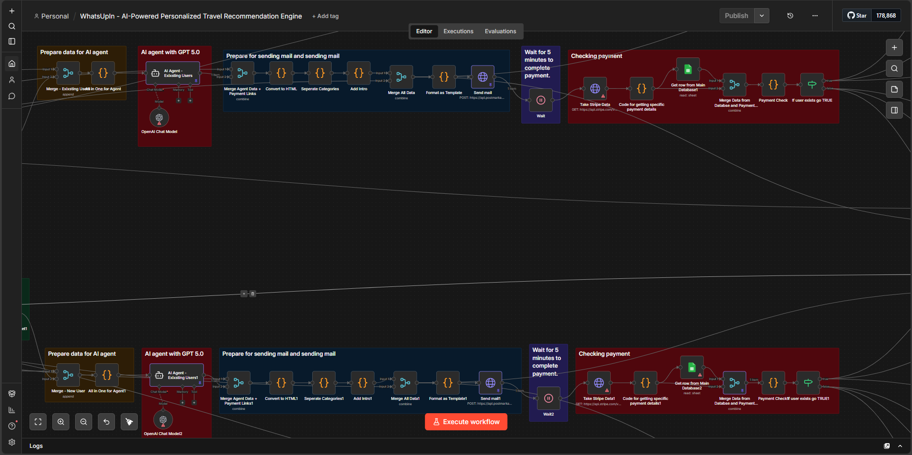
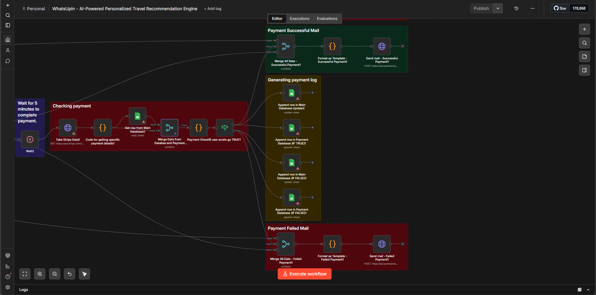

# WhatsUpIn – AI Powered Personalized Travel Recommendation Engine

## Overview
WhatsUpIn is an AI-powered travel recommendation engine that generates **hyper-personalized activity and travel suggestions** based on a user's destination, preferences, travel dates, and group size.

The system automates the full journey from **form submission → AI recommendation → curated travel guide → email delivery**.

Users receive a **beautifully formatted travel guide email** with activities, accommodations, and booking links tailored specifically to their trip.

---

# Project Scope

The main goal of this project is to build a smart AI travel assistant that helps users quickly discover:

- Things to do
- Activities
- Experiences
- Accommodations
- Hidden gems
- Local food spots
- Events and nightlife

All recommendations are generated based on user preferences and real internet sources.

---

# User Flow

## 1. Form Submission

Users submit travel details using **Typeform**.

Collected information includes:

- First Name
- Email
- Preferred Language  
  - English (UK)
  - Spanish
  - German
  - French
  - Dutch
- Travel Destination  
  - City
  - Country
- Number of Travelers
- Travel Dates (Start – End)
- Accommodation Needed (Yes / No)

If **Accommodation = YES**, users provide a **price range per night per person**.

The system then suggests **5 available accommodations** within the budget.

---

# Activity Preferences

Users can select **multiple interests (minimum 3 – maximum 10)**:

- Adventure & Outdoor
- Beaches & Water
- Culture & Heritage
- Events & Festivals
- Food & Gastronomy
- Family-Friendly
- Hidden Gems
- Luxury & Indulgence
- Nature
- Nightlife & Entertainment
- Photo Spots & Viewpoints
- Shopping & Markets
- Wellness & Relaxation

---

# AI Recommendation Engine

The AI agent generates hyper-personalized recommendations based on:

- Destination
- Travel dates
- Group size
- Activity preferences
- Budget (if accommodation is requested)

The system searches for recommendations from multiple sources:

- Google Maps
- Internet sources
- Social media content (Instagram / Facebook / TikTok)

Results are ranked by popularity and relevance.

---

# Email Travel Guide Delivery

After processing the request, the system sends a **personalized travel guide via email**.

Features:

- Delivered in the user's selected language
- Minimum **1500+ words**
- Organized sections for each activity preference
- **3–10 recommendations per category**

Each recommendation includes:

- Description
- Google Maps link
- Booking links (when available)

Email subject:

```
Your personalized travel guide for [location]! 🤩
```

---

# Booking Integrations

If activities or accommodations are bookable, links may point to platforms such as:

- Booking.com
- Airbnb
- GetYourGuide
- Tripadvisor
- Viator
- Tiqets

Affiliate links may be introduced in future versions.

---

# Payment System

Payments are handled via **Stripe**.

Users purchase credits to submit travel guide requests.

### Credit Pricing

| Credits | Price |
|-------|-------|
| 1 Credit | €1 |
| 5 Credits | €5 |
| 10 Credits | €12 |
| 20 Credits | €25 |

Each **form submission consumes 1 credit**.

Credits are deducted **only after successful delivery of the travel guide**.

---

# Credit Tracking

User credits and submission counts are stored using **Google Sheets**.

System features:

- Track total submissions
- Store user credit balances
- Deduct credits after successful email delivery
- Prevent submissions when credits are exhausted

---

# Launch Strategy

In the **initial phase**, the system will be **free to use** in order to:

- Test AI recommendation quality
- Validate the workflow
- Collect user feedback
- Improve recommendation accuracy

---

# Transparency & Smart Recommendations

The AI system is designed to provide **honest travel suggestions**.

Example:

If a user asks for **Nature activities in Barcelona**, the AI may explain that Barcelona is not a nature-focused destination and recommend nearby alternatives.

This ensures **realistic and useful travel advice**.

---

# Technology Stack

The project integrates several tools and services:

- AI recommendation engine
- Workflow automation
- Typeform (form collection)
- Stripe (payments)
- Google Sheets (credit tracking)
- Postmark (email delivery)
- Google Maps (location verification)

---
# Workflow Architecture

Below is the automation workflow used in this project.

## Full Workflow



---

## Workflow Part 1



---

## Workflow Part 2



---

## Workflow Part 3


# Expected Output

After submission, users receive:

- A personalized travel guide
- Activity recommendations
- Accommodation suggestions
- Google Maps links
- Booking links
- Beautifully formatted email

---

# Future Improvements

Planned future improvements include:

- Affiliate booking integration
- Discount codes for travel influencers
- AI itinerary planning
- Mobile app interface
- Improved recommendation ranking using social media trends
- Smart typo correction for locations

---

# Project Goal

The long-term goal of WhatsUpIn is to become an **AI travel assistant that delivers highly personalized travel experiences instantly**, saving users hours of research and planning.


